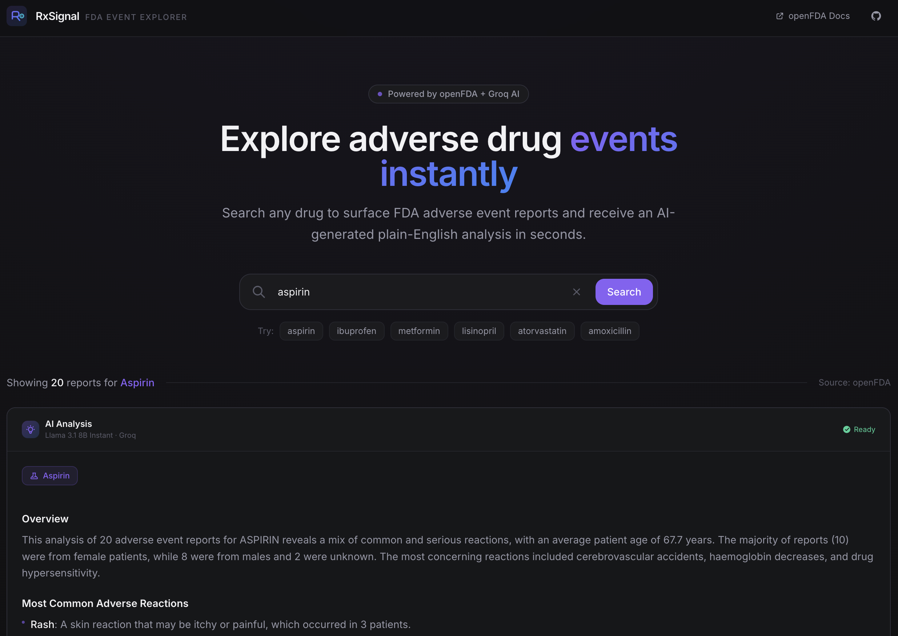

# RxSignal

**AI-powered FDA adverse drug event explorer.**

Search any drug name to instantly surface FDA adverse event reports and receive a plain-English clinical analysis powered by Groq — all in a polished, dark-themed interface.

🔗 **Live demo:** [rxsignal.up.railway.app](https://rxsignal.up.railway.app/)

---

## Screenshot



---

## Tech stack

| Layer    | Technology                                      |
| -------- | ----------------------------------------------- |
| Backend  | Python · Django 4.2 · Django REST Framework     |
| Frontend | React 18 · Vite · Tailwind CSS                  |
| AI       | Groq · Llama 3.1 8B Instant (`groq`)            |
| Data     | openFDA Drug Event API (no key required)        |
| Deploy   | Railway · Docker multi-stage build · WhiteNoise |

---

## Project structure

```
rx-signal/
├── backend/
│   ├── manage.py
│   ├── requirements.txt
│   ├── rxsignal/          # Django project settings & routing
│   │   ├── settings.py
│   │   ├── urls.py
│   │   └── wsgi.py
│   └── api/               # Single Django app
│       ├── views.py        # openFDA fetch + Groq analysis
│       └── urls.py
├── frontend/
│   ├── src/
│   │   ├── App.jsx
│   │   ├── index.css
│   │   └── components/
│   │       ├── Header.jsx
│   │       ├── SearchBar.jsx
│   │       ├── EventCard.jsx
│   │       ├── AiAnalysis.jsx
│   │       └── EmptyState.jsx
│   ├── package.json
│   └── vite.config.js
├── docs/
│   └── screenshot.png
├── .env.example
├── Dockerfile             # Multi-stage Node + Python build
├── railway.json
└── requirements.txt
```

---

## Local setup

### Prerequisites

- Python 3.11+
- Node.js 18+
- A [Groq API key](https://console.groq.com/keys) (free tier works)

### 1 — Clone and configure environment

```bash
git clone https://github.com/Tyypos/rx-signal.git
cd rx-signal
cp .env.example .env
# Edit .env and set GROQ_API_KEY=your_actual_key
```

### 2 — Backend

```bash
cd backend
python -m venv .venv
source .venv/bin/activate       # Windows: .venv\Scripts\activate
pip install -r requirements.txt
python manage.py runserver
# → http://localhost:8000
```

Test the API directly:

```
GET http://localhost:8000/api/events/?drug=aspirin
```

### 3 — Frontend

```bash
cd frontend
npm install
npm run dev
# → http://localhost:5173
```

The Vite dev server proxies `/api/*` to `localhost:8000` automatically.

---

## Environment variables

| Variable               | Required | Description                                         |
| ---------------------- | -------- | --------------------------------------------------- |
| `GROQ_API_KEY`         | Yes      | Groq API key for AI analysis                        |
| `DJANGO_SECRET_KEY`    | No       | Django secret key (auto-generated in dev)           |
| `DEBUG`                | No       | `True` in dev, `False` in production (default True) |
| `ALLOWED_HOSTS`        | No       | Comma-separated hostnames for Django                |
| `CORS_ALLOWED_ORIGINS` | No       | Comma-separated allowed CORS origins for production |

---

## API reference

### `GET /api/events/?drug={name}`

Returns adverse event data and an AI analysis for the given drug name.

**Example response:**

```json
{
    "drug": "aspirin",
    "total_results": 20,
    "events": [
        {
            "reactions": ["Gastrointestinal Haemorrhage", "Nausea"],
            "patient_age": 67,
            "patient_sex": "Female",
            "report_date": "2023-04-12",
            "outcome": "Recovered",
            "serious": true,
            "serious_flags": ["Hospitalization"],
            "concomitant_drugs": ["Warfarin", "Lisinopril"]
        }
    ],
    "ai_analysis": "**Overview**\nBased on 20 spontaneous reports..."
}
```

---

## Deployment (Railway)

RxSignal deploys as a **single Railway service** using a multi-stage Dockerfile that builds the React frontend and bundles it into the Django container, served by WhiteNoise.

**Build flow:**

1. **Stage 1 (`node:20-slim`)** — installs frontend deps with `npm ci` and runs `npm run build`, producing `frontend/dist/`.
2. **Stage 2 (`python:3.11-slim`)** — installs Django deps from `backend/requirements.txt`, copies the backend source, and copies the built `frontend/dist/` from stage 1 into `/app/frontend/dist`.
3. `python manage.py collectstatic --noinput` runs at build time.
4. Container starts Gunicorn: `gunicorn rxsignal.wsgi --workers 2 --bind 0.0.0.0:$PORT`.

**Runtime serving:**

- `/api/*` routes hit Django REST Framework views.
- `/` and any unmatched path (`<path:path>`) return `frontend/dist/index.html` via Django's `FileResponse`, which lets the React Router handle client-side routing.
- All other files (JS bundles, CSS, favicon, etc.) are served by WhiteNoise directly from `frontend/dist/` — `WHITENOISE_ROOT` is set to that directory in `settings.py`, so the URL paths Vite embeds into `index.html` resolve correctly.

**Why `FileResponse` instead of `TemplateView`:** Vite's built `index.html` contains `{}` characters (in inline JSON, module preload hints, etc.) that Django's template engine tries to parse as template syntax, raising `TemplateSyntaxError`. `FileResponse` streams the raw bytes, sidestepping the template layer entirely.

**To deploy your own copy:**

1. Push to GitHub.
2. Create a new Railway project → **Deploy from GitHub repo**.
3. Set environment variables in the Railway dashboard (see table above).
4. Railway detects the `Dockerfile` and builds automatically.

---

## Data source & disclaimer

Adverse event data is sourced from the **FDA Adverse Event Reporting System (FAERS)** via the [openFDA API](https://open.fda.gov/apis/drug/event/). Reports are submitted voluntarily by patients and healthcare providers. This application is for informational and educational purposes only — it is **not** a substitute for professional medical advice, diagnosis, or treatment.
